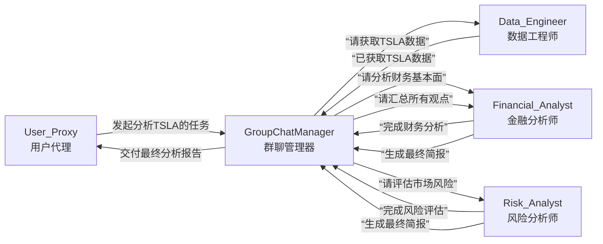
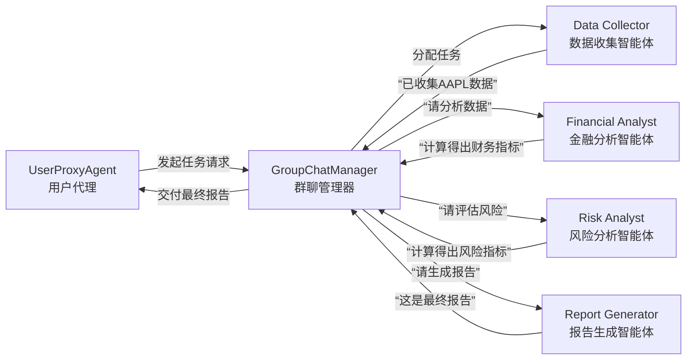

Q:请你简单代码展示一下 autogen核心流程

好的，下面是一个极简但完整的代码示例，展示 AutoGen 多智能体协作的核心流程。

这个例子模拟一个简单的场景：**用户要求一个团队解决一个数学问题**。团队里有两个专家：一个 `Solver`（解题者）和一个 `Verifier`（验证者）。

```python
import autogen

# 配置 LLM（例如使用 OpenAI API）
config_list = [
    {
        "model": "gpt-4",  # 或你使用的其他模型
        "api_key": "YOUR_OPENAI_API_KEY",  # 请替换为你的真实 API Key
    }
]

# 1. 创建「解题者」智能体
solver = autogen.AssistantAgent(
    name="Solver",
    system_message="你是一名数学家。你的任务是解决给定的数学问题，并提供详细的推理步骤和最终答案。",
    llm_config={"config_list": config_list},
)

# 2. 创建「验证者」智能体
verifier = autogen.AssistantAgent(
    name="Verifier",
    system_message="你是一名严谨的验证者。你的任务是审查Solver提供的答案，检查其逻辑和计算是否正确。如果你认为正确，就回复『答案正确』；如果错误，就指出错误并给出你的修正。",
    llm_config={"config_list": config_list},
)

# 3. 创建「用户代理」智能体。它代表人类用户，可以执行代码或终止对话。
user_proxy = autogen.UserProxyAgent(
    name="User",
    human_input_mode="NEVER",  # 设置为 NEVER 来自动运行，设置为 ALWAYS 则在每一步请求人类输入
    code_execution_config={"work_dir": ".", "use_docker": False},  # 允许执行代码
    max_consecutive_auto_reply=10,
)

# 4. 注册智能体之间的对话回复关系（谁可以回复谁）
# 这里我们定义一个简单的双向对话：Solver 和 Verifier 可以相互对话。
groupchat = autogen.GroupChat(agents=[user_proxy, solver, verifier], messages=[], max_round=6)
manager = autogen.GroupChatManager(groupchat=groupchat, llm_config={"config_list": config_list})

# 5. 人类用户通过 UserProxyAgent 发起一个任务，开启群聊
user_proxy.initiate_chat(
    manager,
    message="请我的团队解决这个问题：如果一个长方形的长是10厘米，宽是5厘米，它的面积和周长分别是多少？请分步计算并相互验证。"
)
```

### 运行这段代码会发生什么？（核心流程展示）

当你运行上述代码后，AutoGen 会自动触发多个智能体之间的对话。整个过程可能如下所示：

1.  **User** (to Manager): *"请我的团队解决这个问题：如果一个长方形的长是10厘米，宽是5厘米，它的面积和周长分别是多少？请分步计算并相互验证。"*

2.  **GroupChatManager** (分配任务): 看到问题涉及数学计算，它决定首先让 `Solver` 来解答。

3.  **Solver** (to Manager): *"好的，我来解决这个问题。面积 = 长 × 宽 = 10 cm × 5 cm = 50 cm²。周长 = 2 × (长 + 宽) = 2 × (10 cm + 5 cm) = 2 × 15 cm = 30 cm。所以，面积是50平方厘米，周长是30厘米。"*

4.  **GroupChatManager** (分配任务): 收到 `Solver` 的答案后，管理器认为需要验证，于是让 `Verifier` 发言。

5.  **Verifier** (to Manager): *"我审查了Solver的解答。计算公式和运算过程都是正确的。面积50 cm²和周长30 cm的结果准确无误。答案正确。"*

6.  **GroupChatManager** (结束对话): 验证者确认答案正确，管理器认为任务已完成，对话结束。最终答案会呈现给用户。

### 核心要点总结

从这个简单例子可以看出 AutoGen 的核心运转模式：

1.  **角色定义 (Role-playing)**: 每个 `AssistantAgent` 都有一个 `system_message` 来定义其角色和职责（如数学家、验证者）。
2.  **多代理协作 (Multi-Agent Collaboration)**: 任务不是由一个智能体完成，而是由多个智能体通过**对话**协作完成。`GroupChatManager` 负责协调对话流程。
3.  **动态工作流 (Dynamic Workflow)**: 工作流不是在代码里写死的。管理器会根据对话的当前上下文，动态地决定下一个该谁发言。例如，如果 `Verifier` 发现错误，它可能会要求 `Solver` 重新计算，形成一个循环，直到问题解决。
4.  **用户代理 (User Proxy)**: `UserProxyAgent` 是人类用户的代表，是发起任务和接收最终结果的入口。

这就是 AutoGen 最核心的魅力——**通过模拟一个专家团队的开会讨论，来自动化解决复杂问题**。上面的数学问题可以替换成任何复杂任务（如金融分析、代码生成、报告撰写），只需创建相应的专家智能体即可。

Q: 是的，就是这样， 是需要 金融分析的文章的例子:https://mp.weixin.qq.com/s/3DdN6x2Lgpp5njj1em0Vnw

好的，完全正确。让我们用上面金融分析文章中的角色和场景，构建一个展示 AutoGen 多智能体核心流程的代码示例。

这个示例将模拟：**用户要求分析特斯拉（TSLA）股票，团队中的各个专家智能体（数据收集员、金融分析师、风险分析师）将协作完成这项任务。**

```python
import autogen
from typing import Dict, List

# 1. 配置LLM后端（假设使用OpenAI API）
config_list = [
    {
        "model": "gpt-4",
        "api_key": "YOUR_OPENAI_API_KEY",  # 请务必替换成你的真实API密钥
    }
]

# 2. 创建专业化智能体（Team of Experts）
# 数据工程师智能体：负责获取数据
data_engineer = autogen.AssistantAgent(
    name="Data_Engineer",
    system_message="""你是一名数据工程师专家。你的职责是：
    1. 根据收到的股票代码，使用合适的工具（如yfinance）获取其市场数据、财务报表等。
    2. 确保返回的数据格式清晰，包含价格、财务指标等关键信息。
    3. 你只负责提供原始数据，不进行分析。
    如果无法获取数据，请明确说明原因。
    """,
    llm_config={"config_list": config_list},
)

# 金融分析师智能体：负责基本面分析
financial_analyst = autogen.AssistantAgent(
    name="Financial_Analyst",
    system_message="""你是一名资深金融分析师。你的职责是：
    1. 基于Data_Engineer提供的数据，进行深入的财务分析。
    2. 计算并解读关键财务比率，如PE Ratio、ROE、Profit Margin等。
    3. 评估公司的盈利能力、成长性和财务健康度。
    4. 给出基于基本面的初步看法。
    你的分析必须基于提供的数据，结论要清晰。
    """,
    llm_config={"config_list": config_list},
)

# 风险分析师智能体：负责风险评估
risk_analyst = autogen.AssistantAgent(
    name="Risk_Analyst",
    system_message="""你是一名专业风险分析师。你的职责是：
    1. 基于Data_Engineer提供的历史价格数据，评估投资风险。
    2. 计算波动率、最大回撤等风险指标。
    3. 从市场风险的角度提供见解。
    你的分析必须基于提供的数据，结论要清晰。
    """,
    llm_config={"config_list": config_list},
)

# 3. 创建用户代理智能体
user_proxy = autogen.UserProxyAgent(
    name="User_Proxy",
    human_input_mode="NEVER",     # 演示用，设为NEVER自动运行。实际应用中可设为ALWAYS在关键点介入。
    max_consecutive_auto_reply=10,
    code_execution_config={"work_dir": "coding", "use_docker": False}, # 允许执行代码来获取真实数据
    is_termination_msg=lambda x: x.get("content", "").find("TERMINATE") >= 0, # 定义终止规则
)

# 4. 注册智能体并定义协作群聊
agents = [user_proxy, data_engineer, financial_analyst, risk_analyst]
groupchat = autogen.GroupChat(agents=agents, messages=[], max_round=12) # 限制最大对话轮数
manager = autogen.GroupChatManager(groupchat=groupchat, llm_config={"config_list": config_list})

# 5. 人类用户通过代理发起任务，开启自动化协作流程！
user_proxy.initiate_chat(
    manager,
    message="""
    请分析特斯拉（TSLA）这只股票，为我提供一份投资分析简报。
    请按以下步骤协作：
    1. Data_Engineer：请先获取TSLA的近期股价数据和关键的财务指标。
    2. Financial_Analyst：基于获取的数据，进行财务基本面分析。
    3. Risk_Analyst：基于股价数据，进行风险评估。
    4. 最后请汇总你们的观点。
    完成后请回复『TERMINATE』。
    """
)
```

### 运行此代码后，AutoGen 的协作流程解析

执行上述代码后，AutoGen 框架会自动协调多个智能体进行类似下图的对话流程，最终生成分析报告：



**这个对话流程的核心要点（模拟内容）：**

1.  **任务分配**：`Manager` 收到任务后，理解到需要先获取数据，于是首先指定 `Data_Engineer` 发言。

2.  **工具执行与数据获取**：
    *   `Data_Engineer` 会“思考”并提议运行Python代码（例如使用 `yfinance` 库）。
    *   `User_Proxy` 代理执行这段真实的代码，获取到 TSLA 的股价和财务数据，并将结果返回对话。
    *   **`Data_Engineer` 回复**："已完成数据获取。TSLA 当前股价为 $265.12，最近一季度营收为 $251.67亿，净利润率为 15.2%。以下是详细数据图表..."

3.  **财务分析**：
    *   `Manager` 看到数据已就位，于是让 `Financial_Analyst` 发言。
    *   `Financial_Analyst` 会基于上述真实数据进行分析。
    *   **`Financial_Analyst` 回复**："基于提供的数据，TSLA 的估值（PE）处于行业高位，但其营收增长率和利润率非常强劲，表明...【基于数据的详细分析】。从基本面看，前景乐观但估值不低。"

4.  **风险评估**：
    *   `Manager` 同时（或随后）让 `Risk_Analyst` 发言。
    *   `Risk_Analyst` 会分析股价波动性等。
    *   **`Risk_Analyst` 回复**："计算了TSLA近30天的历史波动率，其年化波动率高达45%，显著高于市场平均水平。最大回撤为-15%，属于高风险资产。"

5.  **汇总与终止**：
    *   `Manager` 最后可能会要求其中一个智能体（或自己）汇总所有观点。
    *   某个智能体会生成最终简报："**TSLA投资简报：** 优势：强大的增长和盈利能⼒；⻛险：⾼估值和⾼波动性。建议：适合⻛险承受能⼒较强的成⻓型投资者。"
    *   一旦内容中包含 "TERMINATE"，对话结束，报告送达用户。

---

### 总结：金融分析中的AutoGen核心流程

通过这个例子，你可以清晰地看到：

1.  **角色专业化**：每个智能体是特定领域的专家，职责分明。
2.  **动态工作流**：`GroupChatManager` 根据任务和对话上下文，**动态地**决定工作流程（先找数据，然后分析，再验证），而不是硬编码的顺序。
3.  **对话即协作**：智能体通过自然语言对话交换信息、请求和结果，形成一个有机的、类似人类团队的协作网络。
4.  **工具使用**：智能体可以提议执行代码（如 `yfinance`），由用户代理执行，将真实世界的数据和分析工具无缝集成到对话中。

这就是 AutoGen 在构建复杂金融分析系统时的核心威力——它不是一个简单的脚本触发器，而是一个可以**动态管理一个专家团队**的智能协调者。


Q:阅读文章：https://mp.weixin.qq.com/s/3DdN6x2Lgpp5njj1em0Vnw ，总结内容和整理好完整代码

好的，我已经阅读并分析了您提供的文章。这是一篇非常详尽的技术文章，探讨了如何利用微软的 **AutoGen** 框架来构建企业级的、智能化的金融数据分析系统。

### 核心内容总结

文章系统地阐述了如何利用 AutoGen 的多智能体协作（Multi-Agent）能力，将复杂繁琐的金融分析任务（如数据收集、财务分析、风险评估、量化建模、报告生成）自动化，构建一个健壮、高效且可扩展的企业级系统。

#### 1. 核心思想与优势
*   **传统模式痛点**：传统（Excel + Python脚本）的方式难以应对金融数据源分散、计算复杂、实时性要求高、合规性严的挑战。
*   **AutoGen 解决方案**：AutoGen 作为一个多智能体协作框架，将分析流程分解，由不同的专业化智能体（Agent）分工合作，通过对话协同完成复杂任务，实现了全流程自动化。
*   **核心优势**：
    *   **自动化**：解放分析师，专注于高价值决策。
    *   **模块化**：智能体各司其职，系统易于维护和扩展。
    *   **可扩展性**：轻松接入新的数据源或分析模块。
    *   **高性能**：支持异步、并发处理，优化大规模数据分析。

#### 2. 系统架构与关键组件
文章描绘了一个分层、模块化的系统架构：

*   **数据层**：负责从多源（Yahoo Finance, Alpha Vantage 等）异步并发地收集、清洗、验证和缓存数据。
*   **分析层**：核心智能体层，包含：
    *   `数据收集智能体 (Data Collector)`
    *   `金融分析智能体 (Financial Analyst)`：计算财务比率（ROE, ROA等），进行杜邦分析。
    *   `风险分析智能体 (Risk Analyst)`：计算 VaR、期望损失、最大回撤、夏普比率等风险指标，并进行压力测试。
    *   `量化分析智能体 (Quantitative Analyst)`：构建因子模型，进行投资组合优化。
*   **决策层**：综合所有分析，生成投资建议和风险预警。
*   **展示层**：自动生成包含文字、图表和评级的综合报告。

#### 3. 企业级最佳实践
文章详细介绍了构建生产级系统所需的关键实践：
*   **性能优化**：异步处理 (`asyncio`)、缓存策略 (Redis)、数据库连接池、内存管理。
*   **监控与可观测性**：使用 Prometheus 和 Grafana 监控系统指标（请求数、延迟、错误率、CPU/内存）。
*   **安全与合规**：数据加密、访问控制、速率限制、输入清洗，确保符合金融监管要求。
*   **错误处理与恢复**：完善的重试机制、降级策略和错误日志记录。
*   **部署架构**：提供了基于 Docker Compose 和 Kubernetes 的微服务部署方案，以及 CI/CD 流水线示例。

#### 4. 未来趋势与创新
文章展望了前沿技术在该系统中的应用可能性：
*   **实时流处理**：对接 Kafka，进行实时市场数据分析与决策。
*   **多模态分析**：结合 OCR 和 NLP 技术分析公司财报、新闻文本和社交媒体情感。
*   **联邦学习与隐私保护**：在保证数据隐私的前提下，利用多方数据进行联合建模。
*   **边缘计算**：将模型优化并部署到移动设备，实现低延迟的本地推理。

#### 5. 示例输出
文章以苹果公司（AAPL）为例，展示了系统最终生成的深度分析报告，涵盖了财务健康度、杜邦分析分解、风险指标、量化因子暴露以及最终的综合投资建议（买入评级，目标价 $185-$205）。

---

### 完整代码整理

以下是文章中核心代码的结构化整理和归纳。由于原始代码非常长，此处提供关键类和方法的框架，并解释其功能。

#### 1. 智能体定义与编排核心框架

```python
import autogen
from typing import Dict, List, Optional
from dataclasses import dataclass
from enum import Enum
import asyncio
import logging

# 定义智能体角色枚举
class AgentRole(Enum):
    DATA_COLLECTOR = "data_collector"
    FINANCIAL_ANALYST = "financial_analyst"
    RISK_ANALYST = "risk_analyst"
    QUANTITATIVE_ANALYST = "quantitative_analyst"
    REPORT_GENERATOR = "report_generator"

# 智能体配置
@dataclass
class AgentConfig:
    name: str
    role: AgentRole
    system_message: str
    llm_config: Dict
    human_input_mode: str = "NEVER"

# 智能体工厂 - 创建具有特定专业知识的智能体
class FinancialAgentFactory:
    def __init__(self, base_llm_config: Dict):
        self.base_llm_config = base_llm_config

    def create_data_collector(self) -> autogen.AssistantAgent:
        system_message = """你是一位专业的数据工程师，擅长多源数据API集成、实时数据流处理和数据质量验证..."""
        return autogen.AssistantAgent(name="data_collector", system_message=system_message, llm_config=self._get_optimized_config())

    def create_financial_analyst(self) -> autogen.AssistantAgent:
        system_message = """你是一位资深的金融分析师，具备财务比率分析、杜邦分析体系、财务预测等专业能力..."""
        return autogen.AssistantAgent(name="financial_analyst", system_message=system_message, llm_config=self._get_optimized_config())
    # ... 类似方法创建 risk_analyst, quantitative_analyst

    def _get_optimized_config(self, temperature: float = 0.1) -> Dict:
        return {**self.base_llm_config, "temperature": temperature, "max_tokens": 8000}

# 智能体编排器 - 管理智能体之间的工作流和对话
class AgentOrchestrator:
    def __init__(self, agents: Dict[str, autogen.AssistantAgent]):
        self.agents = agents

    async def execute_analysis_workflow(self, task: str) -> Dict:
        """执行完整的分析工作流"""
        try:
            data_result = await self._execute_data_collection(task)
            analysis_result = await self._execute_financial_analysis(data_result)
            risk_result = await self._execute_risk_assessment(analysis_result)
            quant_result = await self._execute_quantitative_analysis(analysis_result)
            report_result = await self._execute_report_generation(analysis_result, risk_result, quant_result)
            return {
                "status": "success",
                "data": data_result,
                "analysis": analysis_result,
                "risk": risk_result,
                "quantitative": quant_result,
                "report": report_result
            }
        except Exception as e:
            logger.error(f"工作流执行失败: {str(e)}")
            return {"status": "error", "message": str(e)}

    # ... 具体各个阶段的方法实现 _execute_data_collection, _execute_financial_analysis 等
```

#### 2. 企业级数据管理 (缓存、多源)

```python
import yfinance as yf
import aiohttp
import redis
import json
from abc import ABC, abstractmethod

# 数据源抽象基类
class DataSource(ABC):
    @abstractmethod
    async def fetch_data(self, symbol: str, **kwargs) -> Dict:
        pass

# 具体数据源实现
class YahooFinanceSource(DataSource):
    async def fetch_data(self, symbol: str, **kwargs) -> Dict:
        stock = yf.Ticker(symbol)
        # 并行获取多种数据
        tasks = [
            self._get_financial_statements(stock),
            self._get_market_data(stock),
            self._get_analyst_data(stock)
        ]
        results = await asyncio.gather(*tasks)
        return {**results, 'source': 'yahoo_finance'}

class AlphaVantageSource(DataSource):
    async def fetch_data(self, symbol: str, **kwargs) -> Dict:
        async with aiohttp.ClientSession() as session:
            # 调用 Alpha Vantage API
            pass

# 缓存管理器
class DataCacheManager:
    def __init__(self, redis_url: str = "redis://localhost:6379"):
        self.redis_client = redis.from_url(redis_url)

    async def get_cached_data(self, key: str) -> Optional[Dict]:
        cached_data = self.redis_client.get(key)
        return json.loads(cached_data) if cached_data else None

    async def set_cached_data(self, key: str, data: Dict, expire_time: int = 3600):
        self.redis_client.setex(key, expire_time, json.dumps(data))

# 企业级数据收集器 - 整合多数据源和缓存
class EnterpriseDataCollector:
    def __init__(self, api_keys: Dict[str, str]):
        self.data_sources = self._initialize_data_sources(api_keys)
        self.cache_manager = DataCacheManager()

    async def collect_comprehensive_data(self, symbol: str, use_cache: bool = True) -> Dict:
        cache_key = f"financial_data:{symbol}:comprehensive"
        if use_cache:
            cached_data = await self.cache_manager.get_cached_data(cache_key)
            if cached_data:
                return cached_data

        tasks = [source.fetch_data(symbol) for source in self.data_sources.values()]
        results = await asyncio.gather(*tasks, return_exceptions=True)
        combined_data = self._merge_and_validate_data(results)

        await self.cache_manager.set_cached_data(cache_key, combined_data)
        return combined_data
```

#### 3. 核心分析引擎

```python
import pandas as pd
import numpy as np
from dataclasses import dataclass

# 数据模型
@dataclass
class FinancialMetrics:
    roe: float
    roa: float
    gross_margin: float
    net_margin: float
    current_ratio: float
    # ... 其他许多指标
    def to_dict(self) -> Dict: ...

@dataclass
class RiskMetrics:
    var_95: float
    var_99: float
    expected_shortfall: float
    beta: float
    volatility: float
    sharpe_ratio: float
    max_drawdown: float
    # ... 其他许多指标
    def to_dict(self) -> Dict: ...

# 高级财务分析引擎
class AdvancedFinancialAnalyzer:
    def calculate_comprehensive_metrics(self, financial_data: Dict) -> FinancialMetrics:
        income_stmt = financial_data['financial_statements']['income_statement']
        balance_sheet = financial_data['financial_statements']['balance_sheet']
        # ... 提取数据并计算ROE, ROA, 利润率等各种比率
        return FinancialMetrics(roe=calculated_roe, roa=calculated_roa, ...)

    def perform_dupont_analysis(self, financial_data: Dict) -> Dict:
        # 实现杜邦分析，分解ROE
        return {
            'roe': roe,
            'net_profit_margin': net_profit_margin,
            'asset_turnover': asset_turnover,
            'equity_multiplier': equity_multiplier
        }

# 高级风险分析引擎
class AdvancedRiskAnalyzer:
    def calculate_var(self, returns: pd.Series, confidence_level: float = 0.95) -> float:
        """计算风险价值 (VaR)"""
        return abs(np.percentile(returns, (1 - confidence_level) * 100))

    def calculate_expected_shortfall(self, returns: pd.Series, confidence_level: float = 0.95) -> float:
        """计算期望损失 (ES)"""
        var = self.calculate_var(returns, confidence_level)
        tail_losses = returns[returns <= -var]
        return abs(tail_losses.mean())

    def calculate_comprehensive_risk_metrics(self, price_data: pd.DataFrame, benchmark_data: pd.DataFrame = None) -> RiskMetrics:
        returns = price_data['Close'].pct_change().dropna()
        volatility = returns.std() * np.sqrt(252) # 年化
        var_95 = self.calculate_var(returns, 0.95)
        # ... 计算夏普比率、最大回撤等其他所有风险指标
        return RiskMetrics(var_95=var_95, ...)

# 量化分析引擎
class QuantitativeAnalyzer:
    def build_factor_model(self, stock_data: pd.DataFrame, factor_data: Dict[str, pd.DataFrame]) -> Dict:
        # 使用机器学习模型（如随机森林）构建因子模型
        model = RandomForestRegressor()
        model.fit(factor_returns, stock_returns)
        feature_importance = ... # 获取因子重要性
        return {'model': model, 'feature_importance': feature_importance}

    def optimize_portfolio(self, returns_data: pd.DataFrame, risk_free_rate: float = 0.02) -> Dict:
        # 使用蒙特卡洛模拟进行投资组合优化，寻找有效前沿
        # ...
        return {
            'optimal_weights': optimal_weights_dict,
            'optimal_return': optimal_return,
            'optimal_volatility': optimal_volatility,
            'sharpe_ratio': optimal_sharpe_ratio
        }
```

#### 4. 主执行流程

```python
# 主执行函数
async def execute_enterprise_analysis(symbol: str, api_keys: Dict[str, str]):
    """执行企业级投资分析的总入口函数"""
    try:
        # 1. 初始化组件
        config = EnterpriseAutoGenConfig(api_keys)
        agents = config.create_enterprise_agents() # 创建所有智能体
        data_collector = EnterpriseDataCollector(api_keys)
        financial_analyzer = AdvancedFinancialAnalyzer()
        risk_analyzer = AdvancedRiskAnalyzer()
        quant_analyzer = QuantitativeAnalyzer()

        # 2. 数据收集阶段
        comprehensive_data = await data_collector.collect_comprehensive_data(symbol)

        # 3. 财务分析阶段
        financial_metrics = financial_analyzer.calculate_comprehensive_metrics(comprehensive_data)
        dupont_analysis = financial_analyzer.perform_dupont_analysis(comprehensive_data)

        # 4. 风险分析阶段
        market_data = comprehensive_data['market_data']['price_history']
        risk_metrics = risk_analyzer.calculate_comprehensive_risk_metrics(market_data)

        # 5. 量化分析阶段 (需要额外的因子数据)
        factor_data = {} # 此处需提供因子数据
        factor_model = quant_analyzer.build_factor_model(market_data, factor_data)

        # 6. 汇总结果
        analysis_results = {
            'symbol': symbol,
            'financial_metrics': financial_metrics.to_dict(),
            'dupont_analysis': dupont_analysis,
            'risk_metrics': risk_metrics.to_dict(),
            'factor_model': factor_model,
        }
        return analysis_results
    except Exception as e:
        logger.error(f"企业级分析执行失败: {str(e)}")
        raise

# 使用示例
if __name__ == "__main__":
    api_keys = {
        "openai": "your-openai-api-key",
        "alpha_vantage": "your-alpha-vantage-api-key",
    }
    symbol = "AAPL"
    results = asyncio.run(execute_enterprise_analysis(symbol, api_keys))
    print(f"分析完成: {results}")
```

#### 5. 报告生成器 (简化版)

```python
class ReportGenerator:
    def __init__(self):
        self.template = """
        # {company_name} 财务分析报告
        ## 执行摘要
        {executive_summary}
        ## 财务指标分析
        {financial_metrics_table}
        ## 风险评估
        {risk_assessment}
        ## 投资建议
        {investment_recommendation}
        """

    def generate_report(self, analysis_data: Dict) -> str:
        """根据分析结果生成Markdown格式的报告"""
        executive_summary = self._generate_executive_summary(analysis_data)
        financial_metrics_table = self._create_metrics_table(analysis_data['financial_metrics'])
        risk_assessment = self._generate_risk_assessment(analysis_data['risk_metrics'])
        recommendation = self._generate_recommendation(analysis_data)

        report = self.template.format(
            company_name=analysis_data['symbol'],
            executive_summary=executive_summary,
            financial_metrics_table=financial_metrics_table,
            risk_assessment=risk_assessment,
            investment_recommendation=recommendation
        )
        return report

    def _generate_executive_summary(self, analysis_data: Dict) -> str:
        # 基于财务指标和风险指标生成摘要
        pass
    # ... 其他辅助方法
```

---

### 如何使用这个框架

1.  **安装依赖**：`pip install pyautogen yfinance pandas numpy redis aiohttp`
2.  **准备 API Keys**：获取 OpenAI, Alpha Vantage 等服务的 API 密钥。
3.  **运行基础设施**：确保 Redis 服务器正在运行，用于缓存。
4.  **填充代码**：上述框架中的 `pass` 部分和抽象方法需要根据文章中的详细代码和您的具体需求进行实现。
5.  **执行主函数**：运行 `execute_enterprise_analysis` 函数，传入股票代码和 API 密钥，即可启动自动化分析流程。

这篇文章提供了一个极其强大的企业级金融分析系统的蓝图，将 AutoGen 的多智能体能力与专业的金融工程知识完美地结合了起来。


好的，您指出的非常对。上一部分主要聚焦于代码结构，没有深入解释 AutoGen **多智能体协作的核心运转流程**。这是 AutoGen 最精髓的部分。

下面我将详细解释 AutoGen 是如何利用 **多智能体对话（Multi-Agent Conversation）** 来构建和驱动整个自动化流程的。

### AutoGen 多智能体协作运转机制

AutoGen 的核心思想是：**将复杂任务分解，由一组专门化的智能体（Agents）通过相互对话、协作来完成**。它不是一个按顺序执行脚本的框架，而是一个**模拟人类专家团队开会讨论**的分布式系统。

#### 核心概念

1.  **智能体 (Agent)**：每个 Agent 被赋予一个特定的角色（如数据工程师、金融分析师）、一个系统提示词（`system_message`）和配置（如使用哪个 LLM）。
    *   `AssistantAgent`: 核心工作者，根据其 `system_message` 中的指令执行任务。
    *   `UserProxyAgent`: 用户的代理，可以执行代码（Code Execution）或寻求人类输入（Human-in-the-loop）。

2.  **对话 (Conversation)**：Agents 之间通过交换**消息 (Messages)** 来协作。一个 Agent 收到消息，处理它，然后将回复发送给一个或多个其他 Agents。

3.  **群聊管理器 (GroupChatManager)**：当超过两个 Agent 时，需要一个管理器来协调对话的流转，决定下一个该谁发言。

---

### 金融分析自动化流程的运转详解

让我们以“分析苹果公司（AAPL）投资价值”这个任务为例，拆解 AutoGen 的运转流程。

#### 步骤 1: 初始化与任务触发

首先，您（用户）通过 `UserProxyAgent` 发起一个任务。

```python
# 用户通过 UserProxyAgent 发起任务
user_proxy.initiate_chat(
    manager, # 群聊管理器
    message="请对 AAPL 进行全面的投资价值分析，并生成一份包含财务健康度、风险和投资建议的报告。"
)
```

#### 步骤 2: 智能体协作与对话流转 (核心)

这是一个简化的、可能发生的多智能体对话流程，展示了消息是如何在智能体间传递的：



**这个对话流程的关键点：**

*   **动态性与灵活性**：流程不是硬编码的。`GroupChatManager` 会根据当前对话的上下文和每个 Agent 的 `system_message`，智能地决定下一步该询问哪个专家。如果风险分析师发现数据有问题，它可能会跳回数据收集器要求重新获取数据。
*   **`UserProxyAgent` 的作用**：它是唯一可以执行 Python 代码的 Agent。当 `FinancialAnalyst` Agent 说“让我用 `yfinance` 拉取数据”时，`UserProxyAgent` 会实际执行这段代码并将结果返回，其他 `AssistantAgent` 本身不执行代码。
*   **分工与专业化**：每个 Agent 只关心自己的专业领域。金融分析师不需要知道如何计算 VaR，风险分析师也不需要知道如何做杜邦分析。它们通过清晰的接口（对话）进行协作。
*   **人类介入点 (Human-in-the-loop)**：您可以在任何环节设置 `human_input_mode="ALWAYS"`，让流程暂停并等待您的批准或输入，然后再继续，这对于关键决策非常重要。

#### 步骤 3: 代码执行与工具使用

当对话中需要真实的数据或计算时，`AssistantAgent` 会提议运行代码，由 `UserProxyAgent` 执行。

**在对话中可能发生的代码执行示例：**

```
Financial Analyst Agent (to UserProxyAgent):
我认为我们应该先获取AAPL的财务报表。请运行以下代码：
```python
import yfinance as yf
aapl = yf.Ticker("AAPL")
income_stmt = aapl.financials
balance_sheet = aapl.balance_sheet
# 返回 income_stmt 和 balance_sheet 的前5行数据用于预览
print(income_stmt.head().to_string())
print(balance_sheet.head().to_string())
```

UserProxyAgent (执行代码):
```output
# ... 这里会打印出财务报表的前5行数据 ...
```
执行成功。这是输出的预览，完整数据已存储在变量中。

Financial Analyst Agent (看到结果后):
谢谢。基于这些数据，我现在来计算关键财务比率。ROE为...，毛利率为...
```

#### 步骤 4: 生成最终输出

经过多轮对话和计算后，`ReportGenerator` Agent 会综合所有先前对话中的结论（财务指标、风险指标、量化结果），利用 LLM 的强大归纳和写作能力，生成一份结构完整、语言专业的最终报告，并通过 `GroupChatManager` 返回给 `UserProxyAgent`，最终呈现给您。

---

### 总结：AutoGen 的自动化流程精髓

1.  **以对话为核心**：不是线性的脚本，而是一个动态的、基于会话的工作流。任务状态和上下文保存在对话历史中。
2.  **角色分工 (Role-playing)**：每个 Agent 扮演一个专家角色，其行为和知识范围由其 `system_message` 严格定义。
3.  **工具使用 (Tool Use)**：`AssistantAgent` 负责“思考”和“提议”，`UserProxyAgent` 负责“执行”代码工具，二者分离。
4.  **可引导与可介入**：开发者或用户可以通过设计 `system_message` 和设置 `human_input_mode` 来精确引导或干预自动化流程。
5.  **极高的灵活性**：通过改变 Agents 的组成、`system_message` 和协作规则，可以轻松构建出适应不同复杂场景的自动化系统，远不止于金融分析。

这种模式成功地解决了传统自动化脚本的痛点：**僵硬、难以处理复杂分支、难以集成不同领域的专业知识**。AutoGen 通过多智能体对话，构建了一个真正智能、灵活、且易于理解和维护的自动化流程。